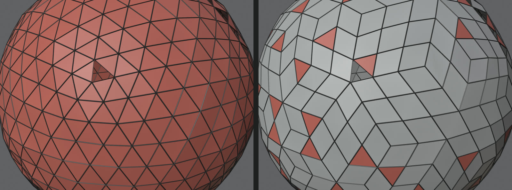
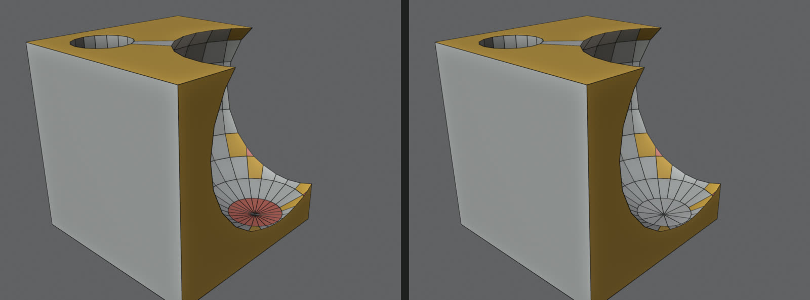

# QuadFix Lite: free Blender add-on to convert n-gons and triangles to quads and clean up meshes

**QuadFix Lite** is a free, open-source add-on for **Blender 4.2 LTS, 4.5 LTS and 5.x**. It turns triangles and curved n-gons into quads, cleans up meshes after **Boolean cuts** and **imports** (STL, OBJ, FBX, CAD, 3D scans, AI-generated meshes) and shows you exactly which faces are still not quads. Three buttons, no settings to learn, works on a selection or on the whole mesh.

[**Download the latest release**](https://github.com/quadfix-tools/quadfix-lite/releases/latest) | Blender 4.2+ | GPL-3.0-or-later | Windows, macOS, Linux (pure Python, no dependencies)

*Triangulated scan-like mesh: before (all red = non-quads) and after N-gons to Quads. Red faces in the result are the ones that are still not quads.*

## What it does

| Button | What it does |
|---|---|
| **N-gons to Quads** | Triangulates curved n-gons and joins triangles into quads. **Flat n-gons (caps, CAD faces) are left alone** by default, so clean flat surfaces stay clean. |
| **Clean & Quad** | One click after a Boolean or an import: merge doubles, remove degenerate and loose geometry, limited dissolve (keeps sharp edges and seams), tris to quads, recalculate normals. |
| **Select Non-Quads & Holes** | Selects every triangle and n-gon and every open boundary edge, and prints the counts in the panel, so you see what is left to fix. |

*Boolean cut result before and after Clean & Quad.*

## Install (Blender 4.2 and newer)

1. Download `quadfix_lite-1.0.0.zip` from the [Releases](https://github.com/quadfix-tools/quadfix-lite/releases/latest) page. **Do not unzip it.**
2. In Blender open **Edit > Preferences > Get Extensions**, click the small arrow menu at the top right and choose **Install from Disk**, then pick the zip.
3. In the 3D viewport press `Tab` (Edit Mode), press `N` and open the **QuadFix Lite** tab.

## How to use

1. Select a mesh, `Tab` into Edit Mode, open the **QuadFix Lite** tab in the sidebar (`N`).
2. Press **Select Non-Quads & Holes** to see what needs work.
3. Select the faces you want to fix (or press `A`) and press **N-gons to Quads** or **Clean & Quad**.
4. Read the before/after counts at the bottom of the panel. `Ctrl+Z` (`Cmd+Z` on Mac) undoes any step in one go.

Untick **Only Selected** to process the whole mesh.

## When to use it

- **After a Boolean cut** leaves triangles, n-gons and loose bits around the cut.
- **STL, OBJ, FBX and CAD imports** (STEP, IGES exported as meshes) full of triangles and duplicate vertices.
- **3D scans and photogrammetry meshes** where you want fewer triangles before sculpting or UV work.
- **AI-generated meshes** (Meshy, Tripo, Hunyuan3D and similar) that come in as triangle soup.
- **Game assets** that must be quads before UV unwrapping, subdivision or baking.
- **3D printing prep**: Select Non-Quads & Holes shows open boundary edges (holes) before you export an STL.

## FAQ

### Why does Tris to Quads (Alt+J) not convert all my triangles in Blender?
Blender's **Face > Tris to Quads** only joins pairs of neighbouring triangles, and only if their normals and the resulting shape are within *Max Face Angle* and *Max Shape Angle*. Options such as *Compare Seams / Sharp / UVs / Materials* block joins across those borders. It also does nothing with n-gons. QuadFix Lite triangulates curved n-gons first, then joins triangles with adjustable angles, and **Aggressive Quads** joins any two triangles regardless of angle when you want the fewest triangles.

### How do I convert n-gons to quads in Blender?
Select the n-gons, triangulate them (`Ctrl+T`) and run Tris to Quads (`Alt+J`). QuadFix Lite does both in one click and skips flat n-gons on purpose. Flat n-gons are harmless unless you plan to subdivide or deform the mesh.

### How do I clean up a mesh after a Boolean in Blender?
Merge by Distance, Limited Dissolve with a few degrees of angle, then Tris to Quads and recalculate normals. **Clean & Quad** runs that sequence, keeps sharp edges and seams, and reports vertex, quad, triangle and n-gon counts before and after.

### How do I find n-gons and triangles in Blender?
**Select > Select All by Trait > Faces by Sides** finds faces with more than 4 vertices. **Select Non-Quads & Holes** finds all triangles and n-gons and the open boundary edges in one click.

### Does it fill holes?
No. QuadFix Lite does not fill holes: closing a hole with a proper quad grid is a separate, harder problem. That is what the full [QuadFix](https://quadfix.gumroad.com/l/quadfix) add-on (paid) does. Lite stays free and complete for what it lists here.

### Is it a retopology tool or a remesher?
No. It repairs the mesh you have and does not rebuild edge flow. On dense scans some triangles will remain. For automatic retopology use a remesher such as Quad Remesher, QRemeshify or Blender's own Quadriflow.

### Does it work with Blender 5.x?
Yes. The test suite (38 checks on Boolean, scan, AI-like and attributed meshes, with vertex, edge and face select modes, partial selections and undo) passes on **Blender 4.2.23, 4.5.14 and 5.2.2**. UVs, vertex groups and colour attributes are preserved.

### Does it phone home or need extra libraries?
No. Pure Python with Blender's own `bmesh`, no internet access, no dependencies.

## Options

| Option | Default | Meaning |
|---|---|---|
| Only Selected | on | Restrict to the selection (off = whole mesh) |
| Face Angle | 90 deg | Max angle between two triangle normals to join them |
| Shape Angle | 90 deg | Max deviation from a rectangle to accept a quad |
| Keep Planar N-gons | on | Leave flat n-gons untouched, convert only curved ones and triangles |
| Aggressive Quads | off | Join any two triangles into a quad, fewest triangles, less regular shapes |
| Merge Distance | 0.0001 | Merge vertices closer than this (Clean & Quad) |
| Dissolve Angle | 5 deg | Limited dissolve angle (Clean & Quad) |
| Keep Sharp Edges | on | Do not dissolve edges marked sharp or seam |

## Limitations

- Not a remesher and not an automatic retopology tool.
- Does not fill holes (see the full version above).
- Very irregular meshes and dense scans keep some triangles. Try **Aggressive Quads** if you prefer fewer triangles over regular shapes.

## Development

`tests/run_all_versions.sh` runs the assertion suite on every Blender found in `/Applications` and `~/Applications/blender-versions`. Bug reports and pull requests are welcome, please attach a small `.blend` that shows the problem.

## License

GPL-3.0-or-later, see [LICENSE](LICENSE). Blender add-ons that use the Blender Python API must be GPL-compatible, and the Blender Extensions platform requires GPL-3.0-or-later for add-ons.

---
*Keywords: Blender add-on, Blender extension, tris to quads, n-gons to quads, convert triangles to quads, clean up mesh after boolean, select non-quads, mesh cleanup, STL import cleanup, 3D scan cleanup, AI generated mesh cleanup, Meshy, Tripo, Hunyuan3D.*
